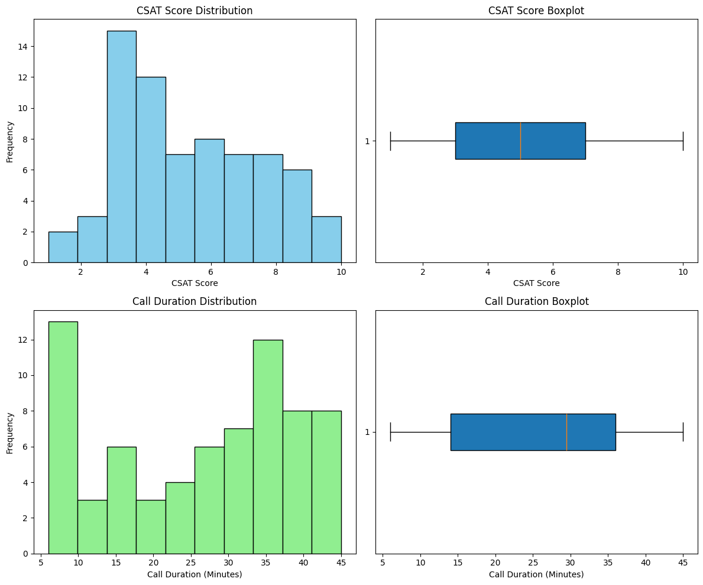
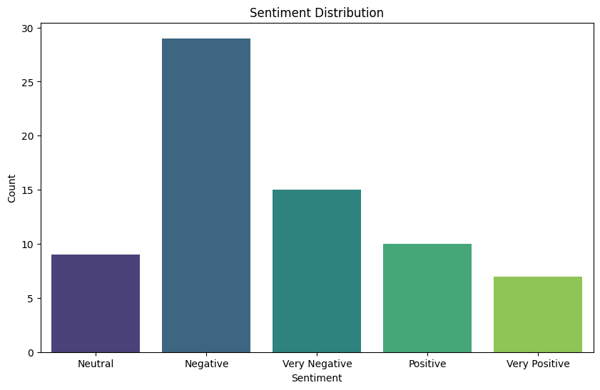
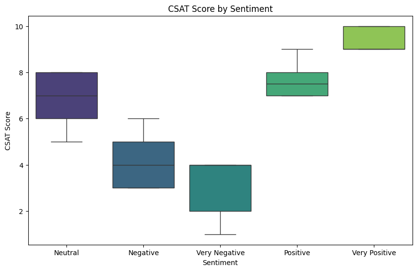
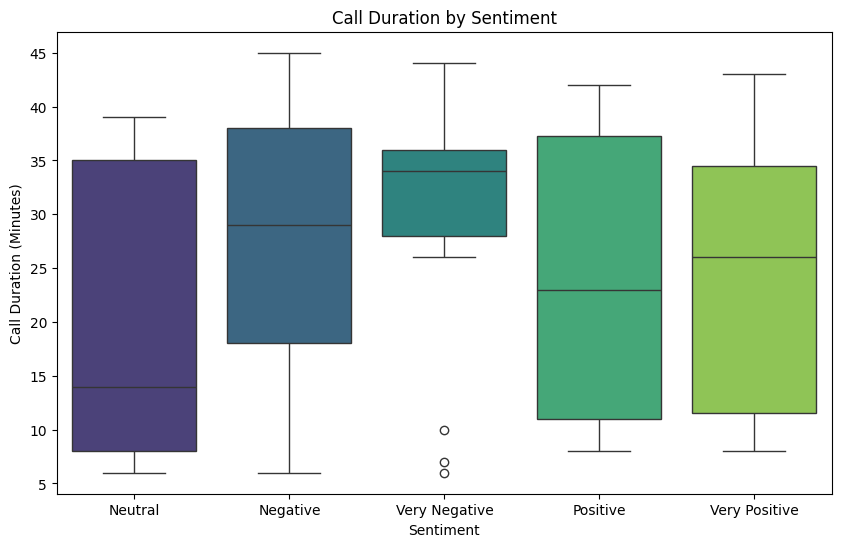

# Call Centre Customer Service Analysis

## Introduction

Customer service quality can make or break a company’s reputation. Call-centres are often at the frontline of customer interactions, making them a crucial component of customer satisfaction strategies.

To ensure that these interactions meet customer expectations, it’s essential to analyse and understand the factors that contribute to positive or negative experiences.

In this project, we delve into a dataset from a call centre and explore key metrics and uncover insights that can help improve call centre operations and ultimately enhance customer satisfaction.

## Background of the Call-Centre Dataset

This dataset originates from a call centre, focusing on customer interactions and feedback.

The data includes various attributes related to customer service experiences, such as customer satisfaction (CSAT) scores, sentiment analysis of the interactions, call details, and response times.

The primary purpose of this dataset is to assess the performance of the call centre and the quality of customer service.

## Potential Insights from the Data

By analysing the data, one can identify areas for improvement, such as reducing response times, enhancing the efficiency of specific communication channels, and addressing factors that lead to negative sentiments and low CSAT scores.

The dataset is valuable for operational analysis, enabling the call centre management to make informed decisions on training, process optimisation, and resource allocation to enhance customer satisfaction and overall service quality.

## Brief Overview of Key Elements in the Dataset

### Customer Satisfaction (CSAT) Scores
A numerical measure (ranging from 1 to 10) that reflects the customer’s satisfaction with the service provided during the interaction.

### Sentiment Analysis
The sentiment of each interaction is categorized as “Very Negative,” “Negative,” “Neutral,” “Positive,” or “Very Positive.”

This sentiment likely results from analysing the customer’s tone, language, and feedback during the call.

### Call Details
Information such as the reason for the call (e.g., billing inquiries), the city and state of the customer, the channel through which the interaction occurred (e.g., Call-Centre, Chatbot, Web), and the call duration in minutes.

### Response Time
Indicates whether the call was responded to within the Service Level Agreement (SLA), below the SLA, or if the issue was escalated or above SLA. This is crucial for understanding the efficiency of the service provided.

### Call Centre Location
The geographical location of the call centre handling the interaction, which could be important for identifying regional performance trends.

## Exploratory Data Analysis (EDA)

The EDA will include:

- **Summary Statistics**: General statistical overview of the numerical and categorical variables.
- **Distribution Analysis**: Understanding the distribution of key numerical variables.
- **Sentiment Analysis**: Breakdown of sentiments and their relationship with other variables.
- **Channel and Response Time Analysis**: Analysing how different channels and response times impact the CSAT scores and sentiments.

## Summary Statistics

### Numerical Summary Statistics

| Column                | Count | Mean  | Std   | Min | Max |
|-----------------------|-------|-------|-------|-----|-----|
| CSAT Score            | 70    | 5.32  | 2.38  | 1   | 10  |
| Call Duration (Minutes)| 70    | 26.25 | 12.57 | 6   | 45  |

#### Numerical Summary Statistics

- There is a wide range of customer satisfaction scores, with a mean score of approximately 5. This indicates that the distribution might be somewhat balanced but leans slightly towards the lower end.
- The call durations also have a wide range, suggesting that a significant number of calls are longer in duration.

### Categorical Summary Statistics

| Column          | Unique | Top              | Frequency |
|-----------------|--------|------------------|-----------|
| ID              | 70     | PIS-39858047      | 1         |
| Customer Name   | 70     | Frances Gullefant | 1         |
| Sentiment       | 5      | Negative         | 29        |
| Reason          | 3      | Billing Question | 50        |
| City            | 57     | Minneapolis      | 3         |
| State           | 29     | Texas            | 9         |
| Channel         | 4      | Call-Centre      | 23        |
| Response Time   | 3      | Within SLA       | 53        |
| Call Centre     | 4      | Los Angeles/CA   | 30        |

#### Categorical Summary Statistics

- There are 5 unique sentiments, with "Negative" being the most common, occurring 29 times. This suggests a potential area of concern for the call centre.
- The most frequent reason for calls is "Billing Question" (50 out of 70 entries), indicating that billing issues are a primary driver for customer inquiries.
- The most common channel is "Call-Centre" (23 occurrences), followed by "Chatbot".
- Most of the calls fall "Within SLA" (53 out of 70), with fewer calls being "Below SLA" or categorized as "Escalated".
- The "Los Angeles/CA" call centre handled the most interactions (30 out of 70), indicating it is a major hub.

## Distribution Analysis

## CSAT Score Distribution

The histogram reveals that the CSAT scores are somewhat evenly distributed but with a slight skew towards lower scores.

The boxplot shows that there are no outliers, and the middle 50% of the data (interquartile range) is spread across a wide range, indicating diverse customer satisfaction levels.

---

## Call Duration Distribution

The histogram indicates that most calls are concentrated in the 20–40-minute range, with fewer calls being significantly shorter or longer.

The boxplot shows that there are a few calls on the longer end that might be considered outliers, but they are not extreme.

---

## Sentiment Analysis

### Sentiment Distribution

The bar plot shows that “Negative” sentiment is the most frequent, followed by “Positive” and “Neutral”.

“Very Negative” and “Very Positive” sentiments are the least common.

## CSAT Score by Sentiment

The boxplot illustrates a clear relationship between sentiment and CSAT scores.

As expected, “Very Positive” sentiment corresponds with higher CSAT scores, while “Very Negative” correlates with the lowest scores.

This trend reinforces the reliability of the sentiment analysis in reflecting customer satisfaction.

## Call Duration by Sentiment

The boxplot for call duration reveals that calls associated with “Very Negative” sentiment tend to be longer, which could indicate more complex issues or dissatisfaction leading to prolonged conversations.

In contrast, “Neutral” and “Positive” sentiments tend to have shorter call durations.

